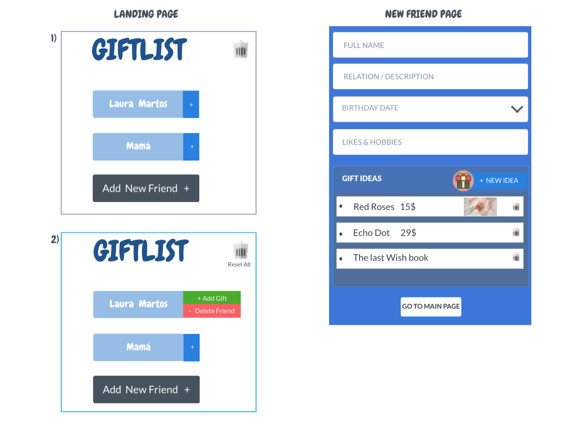
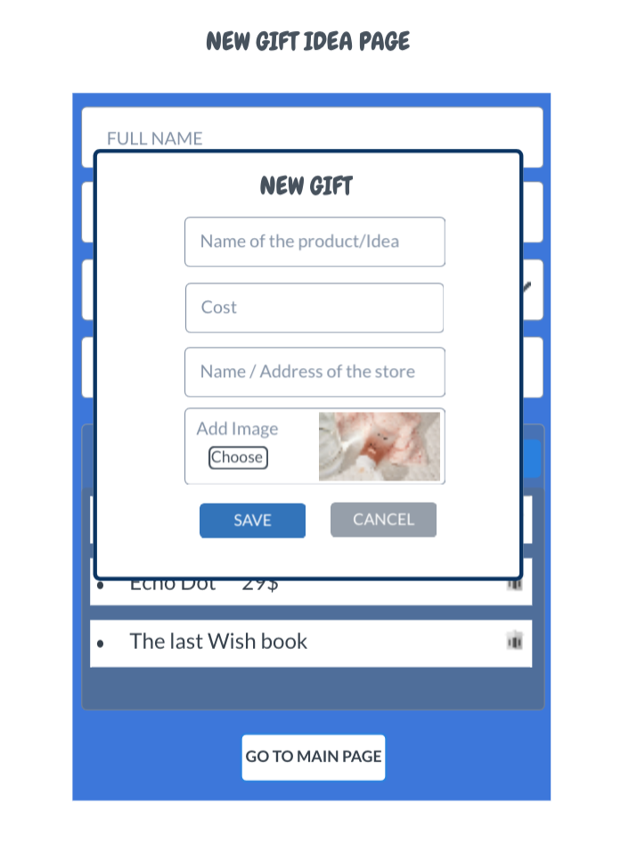

### Fase 1

## 1. Requisitos

# Descripción

En esta primera fase partiré de la premisa de que sólo un único usuario utilizará la aplicación y guardará toda la información
en el local storage para posteriormente acceder a ella cuando vuelva a abrir la aplicación.

Inciaremos la aplicación con una Landing Page con un botón "New Friend +" para añadir un nuevo usuario al que queramos
hacer un regalo. Tras pulsar el botón, pasaremos a una segunda página donde escribiremos los datos del "New Friend". 
A continuación, pulsaremos en el botón "Add gift" y saltará un modal donde introduciremos los datos de la idea o regalo pensado: nombre del objeto o idea, descripción, imagen, coste y nombre de la tiende donde comprarlo. 
Asimismo, si queremos subir una imagen y la tenemos almacenada, la podremos subir directamente. Sino, podremos hacer una fotografía en el instante y subirla o 
podremos dejar ese campo vacío. En el caso de que haya una imagen subida, se verá una pequeña previsualización en el modal.
Cuando cerremos el modal, se añadirá el nombre del regalo debajo de "Gift Ideas". Cuando el usuario cierre la aplicación, 
la información seguirá guardada.

Para lo cual quiero:

- Crear un evento que tendrá lugar cuando el usuario haga click sobre el botón de "New Friend +"
- Rellenar los campos de formulario
- Abrir modal al hacer click sobre el botón "Add gift"
- Rellenar datos del segundo formulario.
- Añadir imagen y mostrar en previsualización dentro del modal.
- Guardar la información en un local storage.
- Cerrar modal con un botón de Cerrar y volver al perfil del "Friend" donde pintaremos el nombre del regalo que acabamos de añadir y un nuevo botón 
 "Add gift" para seguir agregando regalos.
- Habrá una opción Delete Gift para eliminar el regalo al hacer hover sobre el regalo.
- Guardar la información de nuevo.
- Clickar botón "Go to Main Page" para volver a la landing.
- Landing con el nombre del nuevo usuario pintado.

# Requisitos técnicos

- Get y Fetch para guardar los datos y recogerlos de un servidor fake.
- Eventos sintéticos de React.
- Manejo de componentes para pintar los elementos de los formularios.
- Maquetación.

## 2. Prototipo: 

1 - Landing
2 - New Friend Page
3 - New Gift Idea Page

[Prototipo en vivo](https://marvelapp.com/project/4623574/canvas/65041706/)

## 3. Planificación
Tareas de la Fase 1: a desarrollar

## 4. Desarrollo

## 5. Feedback y valoración

Para saber si he cumplido mi objetivo voy a:

Probar la aplicación con datos de entrada.
Probar a entrar y salir de la aplicación para comprobar que los datos se han guardado correctamente. 
Enseñárselo a compañeros para que me dé feedback.